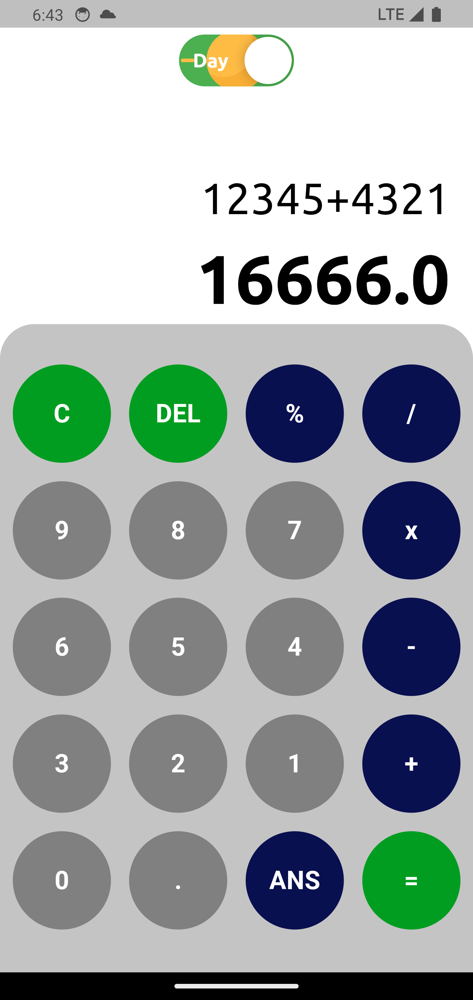
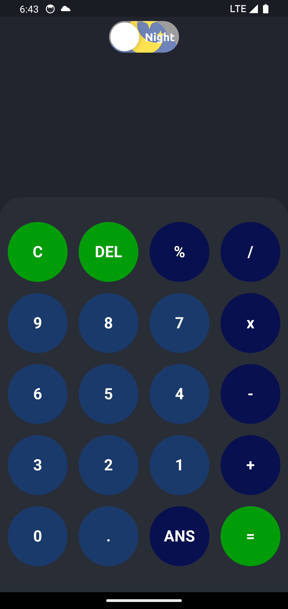
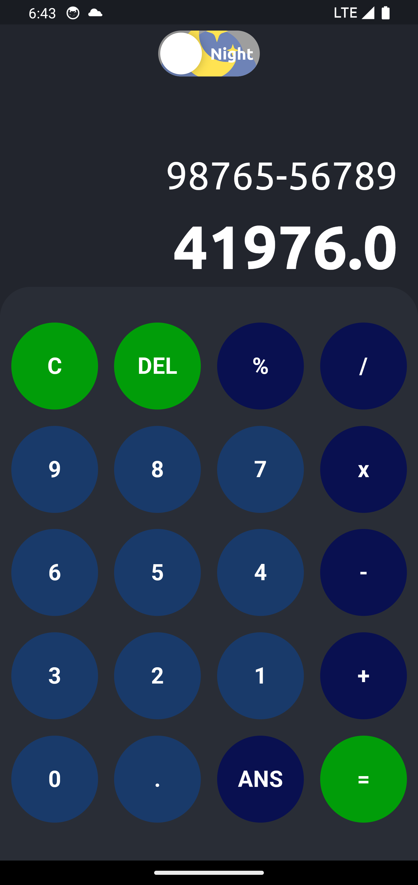

# calculator_app

Flutter ile geliştirilmiş GetX mimarisi kullanılarak state yönetimleri sağlanan bir mobil hesap makinesi uygulaması.

## Kullanılan Teknolojiler

- flutter
- GetX
- math_expressions

## Ekran Görüntüleri
 

- Day Mode

  

- Night Mode

